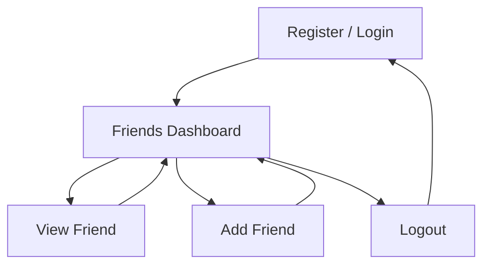

# 👥 Friends Manager

A full-stack web application for managing your personal circle of friends. Create an account, add friends and keep their details organised in one place.

## ✨ Features

* **🔐 User Authentication**  
Register and log in with a personal account.

* **👥 Personal Friend List**  
Each user sees only their own friends.

* **➕ Add Friends**  
Add and store essential friend details.

* **📄 Friend Profiles**  
View detailed information about individual friends.

* **🔒 Protected Routes**  
Restrict application pages to logged-in users.

* **🚪 Logout**  
End the current user session.

* **💾 Persistent Storage**  
Store user and friend data using SQLite.

* **📱 Responsive UI**  
Adapt the interface across different screen sizes.

## 🛠️ Tech Stack

### Frontend

[](https://react.dev/)
[](https://reactrouter.com/)
[](https://vite.dev/)
[](https://developer.mozilla.org/en-US/docs/Web/JavaScript)
[](https://developer.mozilla.org/en-US/docs/Web/CSS)

---

### Backend

[](https://nodejs.org/)
[](https://expressjs.com/)

---

### Database

[](https://www.sqlite.org/)
[](https://www.npmjs.com/package/sqlite3)

## 📁 Project Structure

```text
friends-manager-app/
├── backend/
│   ├── database.js
│   ├── server.js
│   ├── package.json
│   └── package-lock.json
│
├── frontend/
│   ├── public/
│   ├── src/
│   │   ├── assets/
│   │   ├── components/
│   │   │   ├── Header.jsx
│   │   │   ├── Footer.jsx
│   │   │   ├── Layout.jsx
│   │   │   └── ProtectedRoute.jsx
│   │   │
│   │   ├── pages/
│   │   │   ├── Login.jsx
│   │   │   ├── Register.jsx
│   │   │   ├── Dashboard.jsx
│   │   │   ├── FriendDetails.jsx
│   │   │   └── AddFriend.jsx
│   │   │
│   │   ├── App.jsx
│   │   ├── App.css
│   │   ├── index.css
│   │   └── main.jsx
│   │
│   ├── eslint.config.js
│   ├── index.html
│   ├── package.json
│   ├── package-lock.json
│   └── vite.config.js
│
├── .gitignore
└── README.md
```

## 🚀 Getting Started

### Prerequisites

Make sure the following are installed on your system:

- [Node.js](https://nodejs.org/)
- npm (included with Node.js)
- [Git](https://git-scm.com/)

You can verify the installations with:

```bash
node --version
npm --version
git --version
```

### 1. Clone the Repository
---
Clone the repository and navigate into the project directory:

```bash
git clone https://github.com/SilverSquare-22/friends-manager-app.git
cd friends-manager-app
```

### 2. Install Backend Dependencies
---

Open a terminal in the project directory and run:

```bash
cd backend
npm install
```

### 3. Install Frontend Dependencies
---

Open a second terminal in the project directory and run:

```bash
cd frontend
npm install
```

After completing these steps, the project is ready to run locally.

## ▶️ Running the Application

The backend and frontend run separately, so open **two terminals**.

### Terminal 1 — Backend
---
From the project root:

```bash
cd backend
node server.js
```

The backend will start at:

```
http://localhost:5000
```

### Terminal 2 — Frontend
---
From the project root:

```bash
cd frontend
npm run dev
```

Vite will display the local development URL in the terminal, usually:

```
http://localhost:5173
```

Open the displayed URL in your browser to use the application.

## 🔄 How It Works

### Application Architecture


### User Flow



## 🔌 API Documentation

The backend provides REST API endpoints for user authentication and friend management.

| Method | Endpoint | Purpose |
|:---:|---|---|
| `POST` | `/api/register` | Create a new user account |
| `POST` | `/api/login` | Authenticate a user |
| `GET` | `/api/friends?userId=:userId` | Retrieve the user's friends |
| `GET` | `/api/friends/:id?userId=:userId` | Retrieve a specific friend |
| `POST` | `/api/friends` | Add a new friend |

### Request Examples

**Register — `POST /api/register`**

```json
{
  "username": "moonpie",
  "password": "password123"
}
```

**Login — `POST /api/login`**

```json
{
  "username": "moonpie",
  "password": "password123"
}
```

**Add Friend — `POST /api/friends`**

```json
{
  "userId": 1,
  "name": "Anagha",
  "email": "anagha@example.com",
  "phone": "+91 9988776655",
  "role": "Creative Designer",
  "bio": "Loves art and music.",
  "hobbies": "Painting, Music",
  "image_url": "https://example.com/image.jpg",
  "date_joined": "2026-08-23"
}
```

## 🗄️ Database

The application uses **SQLite** for local data storage.

Two tables are used:

- **`users`** — Stores registered user accounts.
- **`friends`** — Stores friend details and associates each friend with a user through `user_id`.

The SQLite database file is created automatically inside the `backend` directory when the server starts.

The database file is excluded from version control using:

```
.gitignore
*.db
```

This prevents local user data from being committed to the repository.

## 📸 Preview

<!-- Screenshots will be added after deployment. -->


## 🌐 Live Demo

<!-- Live demo link will be added after deployment. -->

## 👨‍💻 Developed By

**Anagha Parameswar**

[LinkedIn](https://linkedin.com/in/silversquare22) · [GitHub](https://github.com/SilverSquare-22)

*Built with React, Node.js, Express and SQLite.*